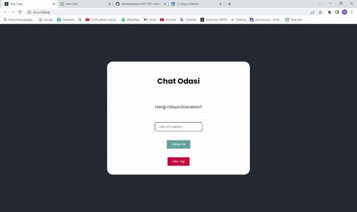

# Firebase Chat App with React

This is a simple chat application built with Firebase and React.

<h1>Setup</h1>

1. Clone the repository to your local machine.
2. Run npm install to install the dependencies.
3. Go to the Firebase console and create a new project.
4. Go to the Authentication section and enable Google sign-in.
5. Go to the Database section and create a new Cloud Firestore database.
6. Set the rules for the database to allow read and write access.
7. Add your Firebase project configuration to the src/firebase.js file.
8. Run npm start to start the development server.

<h1>Features</h1>

<ul>
 <li>Google sign-in for authentication.</li>
 <li>Real-time chat using Firebase Cloud Firestore.</li>
 <li>User presence status using Firebase Realtime Database.</li>
 <li>Responsive design using Bootstrap.</li>
</ul>

<h1>How to Use</h1>

1. Sign in using your Google account.
2. Start chatting with other users who are online.
3. Send and receive messages in real-time.
4. Logout when you're done.

<h1>ScreenGif</h1>

